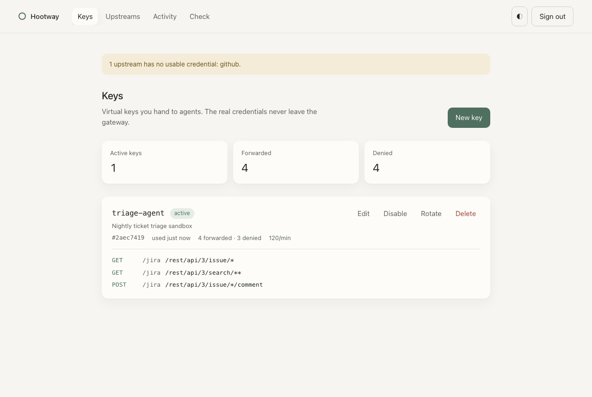
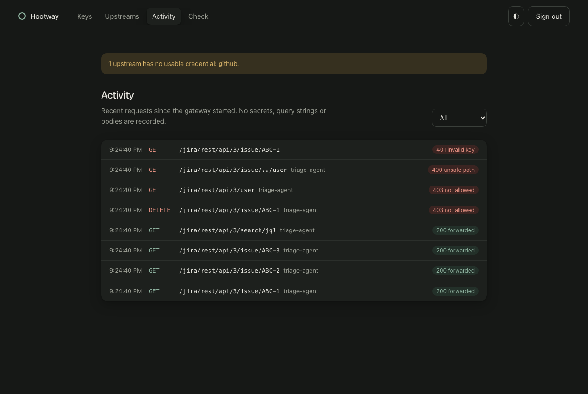
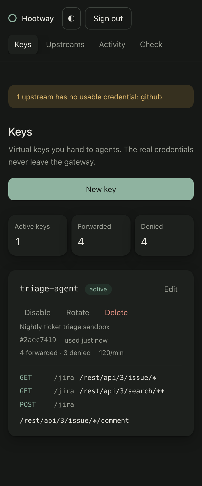

# Hootway

Hootway is a small API gateway for agent sandboxes. Give an agent a **virtual
key** and the Hootway URL instead of a real Jira, GitHub or other API
credential. Hootway checks the key, allows only the methods and paths you
granted, injects the real credential and forwards the request upstream.

```text
agent sandbox ── Bearer hw_… ──▶ Hootway ── Basic <real Jira token> ──▶ your-site.atlassian.net
                                   │
                                   ├─ key hashed, expiring, revocable
                                   ├─ per-key method + path grants
                                   ├─ per-key rate limit
                                   └─ JSON audit log (no secrets)
```

The agent never sees the upstream secret. Revoking or narrowing access is a
config change, not a credential rotation.

## Quick start (Jira Cloud)

```sh
go install github.com/openhoo/hootway/cmd/hootway@latest

hootway key new            # prints a hw_… key and its sha256
cp examples/jira.json hootway.json
# put the sha256 into keys[0].sha256 and set your Jira site in base_url

export JIRA_EMAIL=bot@example.com JIRA_API_TOKEN=…   # the real credential stays here
hootway check -config hootway.json
hootway serve -config hootway.json
```

Inside the sandbox, the agent only gets:

```sh
export JIRA_BASE_URL=http://hootway.internal:8787/jira
export JIRA_TOKEN=hw_…        # virtual key
curl -H "Authorization: Bearer $JIRA_TOKEN" "$JIRA_BASE_URL/rest/api/3/issue/ABC-1"
```

Tools that only support e-mail + API token basic auth also work: Hootway
accepts the virtual key as the basic-auth password and ignores the username.
`X-Hootway-Key: hw_…` is a third option.

## Web console



A calm, built-in console for keys, upstreams, live activity and policy checks.
It runs on a **separate listener** so an agent that can reach the gateway
cannot reach the console.

```sh
hootway admin token                 # prints an hwa_… token and its sha256
export HOOTWAY_ADMIN_TOKEN=hwa_…    # or put the sha256 into admin.token_sha256
hootway serve -config hootway.json -admin-listen 127.0.0.1:8788
```

Open <http://127.0.0.1:8788> and sign in with the token.

- **Keys** — create, edit, disable, rotate or delete keys and their access
  rules. A new or rotated key is shown once, with a copyable sandbox snippet;
  only its hash is saved.
- **Upstreams** — base URL, credential type and where the secret comes from
  (environment variable or file). Secrets are never typed into the console;
  upstreams whose secret is missing are flagged and answer `503` until fixed.
- **Activity** — the last 1,000 requests with key, method, path and outcome.
  No query strings, bodies or credentials are recorded.
- **Check** — asks the active policy whether a key may call a method and path,
  without contacting the upstream.

Changes are validated, written atomically to the config file and applied
without a restart. Light and dark themes follow the system and can be toggled.

| Activity (dark) | Mobile |
| --- | --- |
|  |  |

Keep the console on localhost or behind your own TLS and access control. The
admin API is also scriptable with `Authorization: Bearer hwa_…` and the
`X-Hootway-Console: 1` header for writes.

## Configuration

| Field | Meaning |
| --- | --- |
| `listen` | Address, default `127.0.0.1:8787`. |
| `admin.listen` | Console address, default `127.0.0.1:8788`. Must differ from `listen`. |
| `admin.token_sha256` | SHA-256 of the console token (or set `HOOTWAY_ADMIN_TOKEN`). |
| `upstreams[].name` | Route prefix: `/<name>/…` forwards to this upstream. |
| `upstreams[].base_url` | Upstream origin and optional base path. |
| `upstreams[].auth.type` | `basic`, `bearer`, `header`, `query` or `none`. |
| `upstreams[].auth.secret_env` / `secret_file` | Where the real secret comes from. Never inline. |
| `upstreams[].auth.username` / `username_env` | Basic-auth user (Jira: account e-mail). |
| `upstreams[].auth.name`, `prefix` | Header or query name; optional value prefix for `header`. |
| `upstreams[].headers` | Fixed extra headers. Auth, cookie and hop-by-hop headers are refused. |
| `upstreams[].description`, `keys[].description` | Optional notes shown in the console. |
| `keys[].sha256` | SHA-256 of the virtual key. Plain keys are never stored. |
| `keys[].expires_at`, `disabled` | Expiry (RFC 3339) and immediate revocation. |
| `keys[].requests_per_minute` | Per-key limit, `0` = unlimited. |
| `keys[].grants[]` | `upstream`, `methods` (`GET`, … or `*`) and `paths`. |

Path patterns are upstream-relative: `*` matches exactly one segment, a final
`/**` matches the prefix and everything below it. Configuration is strict:
unknown fields, unknown upstreams and malformed grants fail `hootway check`.

## Security model

- Requests are denied unless a grant matches. Denials never reach the upstream.
- Paths with `..`, `.` segments, `//`, backslashes or encoded `/`, `\`, `.` or NUL
  are rejected so the policy and the upstream see the same path.
- Caller `Authorization`, `Cookie`, `Proxy-Authorization`, `X-Hootway-*` and
  `X-Forwarded-*` headers are stripped; agent-supplied query credentials are
  overwritten for `query` auth.
- `Set-Cookie` is removed from responses so sessions cannot leak to the agent.
  Same-origin `Location` redirects are rewritten back through Hootway.
- Logs contain key id, upstream, method, path, status, outcome and duration —
  never key values, secrets or bodies.
- Hootway authorizes the HTTP shape of a request. Grant writes narrowly: an
  allowed endpoint can still do anything that endpoint does upstream.
- Run Hootway outside the sandbox and make sure the sandbox can reach only the
  gateway, not the upstream directly. Use TLS (e.g. an ingress) when it crosses
  a network.

## Container

```sh
docker build -t hootway .
docker run --rm -p 8787:8787 -p 127.0.0.1:8788:8788 \
  -v $PWD/config:/etc/hootway \
  -e JIRA_EMAIL -e JIRA_API_TOKEN -e HOOTWAY_ADMIN_TOKEN hootway \
  serve -config /etc/hootway/hootway.json -listen 0.0.0.0:8787 -admin-listen 0.0.0.0:8788
```

Mount the config directory writable if you want console changes to persist
(the file is replaced atomically). Publish the console port only on localhost
or an internal network.

```sh
```

`GET /healthz` returns `{"status":"ok"}` without authentication.

## Agent skills

- `hootway-agent-access` — for agents and operators using a Hootway gateway:
  `npx skills add openhoo/hootway --skill hootway-agent-access`
- `hootway-development` — for contributors to this repository (also exposed
  under `.agents/skills`).

## Development

```sh
gofmt -l . && go vet ./... && go test -race -cover ./...
```

## License

Apache-2.0. See [LICENSE](LICENSE).
